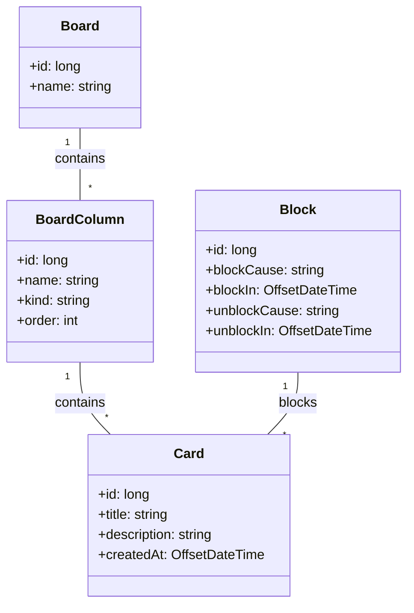

# Board de Tarefas 
No segundo projeto o desafio era desenvolver um board de tarefas. Cada board possui suas colunas sendo 3 obrigatórias (inicial, final e cancelada) e podendo existir colunas não obrigatórias também. Nas colunas dos boards podem existir cards, sendo possivel mudar o status (bloqueado e desbloqueado) e mudar de coluna, além do usuário receber uma descrição de quantas vezes já foi bloqueado e o motivo. Para a conexão com o Banco de Dados utilizei o MySQLWorkbench. Para a abstração do projeto foi desenvolvido um diagrama de classes na sintaxe mermaid.

